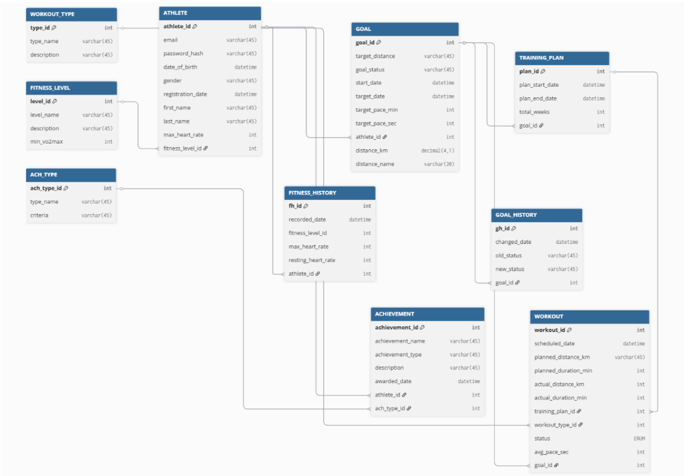

# Marathon Training Planner — Database Design

Учебный проект по дисциплине «Проектирование и реализация баз данных»  
**Университет ИТМО**, факультет прикладной информатики, 2025

---

## О проекте

Реляционная база данных для системы «Виртуальный тренер по марафонскому бегу» —  
приложения, которое помогает спортсменам-любителям готовиться к забегам на 5 км, 10 км, полумарафон и марафон.

Система хранит профили спортсменов, тренировочные планы, историю тренировок и достижения.  
Спроектирована от анализа предметной области до физической реализации в MySQL 8.0.

---

## Стек

---

## Структура репозитория
├── schema.sql        # DDL: создание всех таблиц, ограничений, индексов
├── seed_data.sql     # DML: тестовые данные
├── queries.sql       # DQL: 10 аналитических запросов
├── er_diagram.png    # ER-диаграмма финальной модели (нотация Crow's Foot)
└── README.md
---

## Модель данных

Финальная физическая схема содержит **11 таблиц**.

Ключевые сущности:

| Таблица | Описание |
|---|---|
| `athletes` | Профиль спортсмена |
| `goals` | Спортивная цель (дистанция, срок) |
| `training_plans` | Тренировочный план, привязанный к цели |
| `workouts` | Конкретная тренировка с плановыми и фактическими метриками |
| `achievements` | Справочник наград |
| `athlete_achievement` | Факт присвоения награды спортсмену (M:N) |
| `fitness_levels` | Справочник уровней подготовки |
| `workout_types` | Справочник типов тренировок |
| `goal_history` | История изменений цели |
| `fitness_history` | История физических показателей |
| `ach_types` | Типы достижений |

---

## Этапы проектирования

- **Анализ предметной области** — интервью с экспертом, выявление бизнес-правил, матрица связей
- **Концептуальная модель** — ER-диаграмма в нотации Crow's Foot, разрешение M:N через ассоциативную сущность
- **Нормализация** — последовательно UNF → 1NF → 2NF → 3NF, устранены 4 транзитивные зависимости
- **Денормализация** — 4 приёма для оптимизации операций чтения: встраивание ENUM-справочников, хранимые вычисляемые поля (`avg_pace_sec GENERATED ALWAYS AS`), слияние сущностей 1:1, дублирование FK
- **Физическая модель** — адаптация под MySQL 8.0: UNSIGNED-типы, каскадные операции, составные индексы

---

## SQL — что реализовано

**DDL (6 операторов)**
- `ALTER TABLE` — добавление CHECK-ограничений на пульс и даты
- `CREATE INDEX` — индексы на `email`, `goal_status`, `scheduled_date`

**DML (7 операторов)**
- INSERT нового спортсмена, цели, записи о тренировке
- UPDATE статуса цели, фитнес-показателей
- DELETE ошибочной записи

**DQL (10 запросов)**

| № | Что считает | Ключевые операторы |
|---|---|---|
| 1 | Список спортсменов по дате регистрации | `ORDER BY` |
| 2 | Активные цели с именами спортсменов | `WHERE`, `JOIN` |
| 3 | Общее число тренировок | `COUNT` |
| 4 | Средняя длительность тренировки | `AVG` |
| 5 | Суммарный пробег по каждому спортсмену | `SUM`, `GROUP BY` |
| 6 | Спортсмены без поставленных целей | `LEFT JOIN` |
| 7 | Достижения с типом награды | `JOIN` × 2 |
| 8 | Количество тренировок по статусам | `GROUP BY` |
| 9 | Спортсмены с пробегом более 10 км | `HAVING` |
| 10 | Диапазон пульса по каждому спортсмену | `MIN`, `MAX` |

---

